# Unsupervised learning

## Unsupervised Learning: Introduction

While supervised learning algorithms need labeled examples (x,y), unsupervised learning algorithms need only the input (x)
 
 In layman terms, unsupervised learning is learning from unlabeled data

Unsupervised learning:
- Data has No labels
- We have to find structure in data
- We have to find clusters in the data:
  - This is called clustering and is one of the many unsupervised learning algorithm

Applications of clustering
- Market segmentation
- Group people into different segments
- Social network analysis
- Smart lists
- Organize computing clusters
- Astronomical data analysis
   - Understanding galaxy formation

## Clustering

### K-Means Algorithm

#### Definition

We want to automatically group the data into clusters

K-Means Algorithm is the most widely used clustering algorithm.

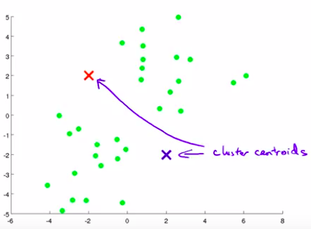

1. K-Means Algorithm randomly initialize K points called the cluster centroids. K = number of future groups of data.
   - We have two centroids here because we want to group the data into 2 clusters
   - You can have as many, but the exact "ideal" number can be determined and will be explained subsequently.
2. K-Means is an iterative Algorithm and it does 2 steps in the inner loop:
   1. Cluster assignment step
            - What that means is that, it's going through each of the examples, each of these green dots shown here and depending on whether it's closer to the red cluster centroid or the blue cluster centroid, it is going to assign each of the data points to one of the two cluster centroids
  
    2. Move centroid step
            - Take the two cluster centroids, that is, the red cross and the blue cross, and we are going to move them to the average of the points colored the same colour
  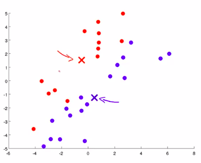
            - Continue until it converges
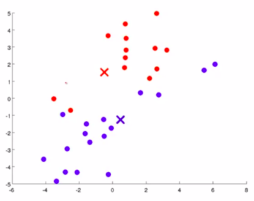
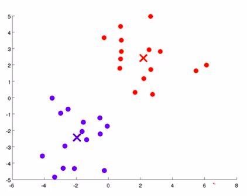

Let's write K-means more formally:

#### K-means notation

- Training set $\{x^{(1)}, x^{(1)}, \cdots , x^{(m)}\}$ with $x^{(i)} \in \mathbb{R^n}$ dimensional vector
  - (drop $x_0=1$ convention)
- K: number of clusters
- k: cluster number, $k \in \{1,2, \cdots , K\}$
- $c^{(i)}$ = index of cluster (1,2,...,K) to which example $x^{(i)}$ is currently assigned.
- $\mu_{k}$ = cluster centroid k $(\mu_{k} \in \mathbb{R^n})$
- $\mu_{c^{(i)}}$ = cluster centroid of cluster to which example $x^{(i)}$ has been assigned.

#### Algorithm

Randomly initialize K cluster centroids $\mu_1, \mu_2, \cdots, \mu_K \in \mathbb{R}^n$

Repeat {

\# Cluster assignment step
\# We use $\left\lVert x^{(i)} - \mu_k \right\rVert^2$ to calculate distance
$\quad$ for i=1 to m
    $\qquad c^{(i)}:=$ index from (1 to K) of cluster centroid closest to $x^{(i)}$

\# Move centroid step
$\quad$ for k=1 to K
    $\qquad \mu_k:=$ average (mean) of points assigned to cluster $k$
}

-----

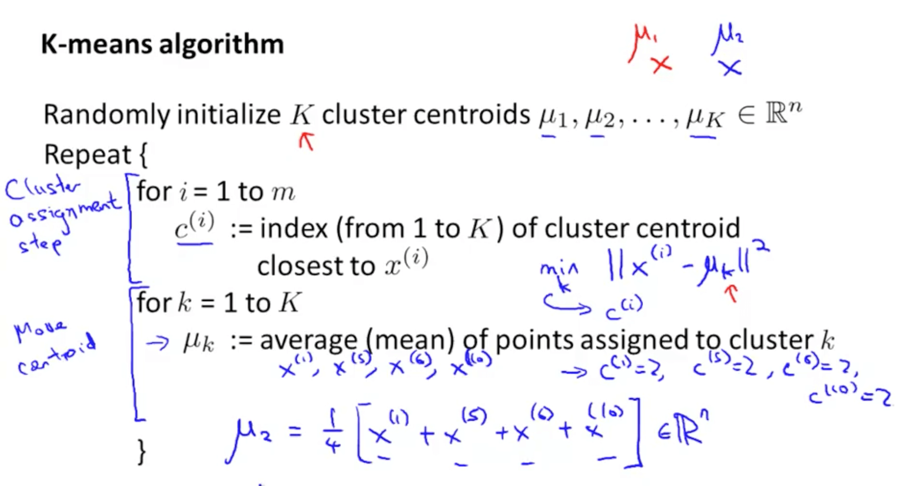

- K-means for non-separated clusters

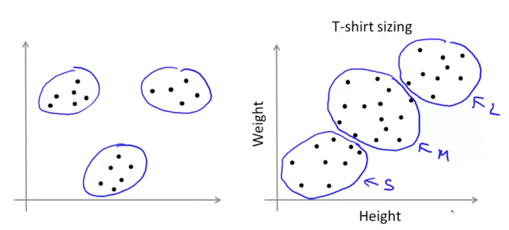
  - K-means would try to separate the data into multiple clusters like the graph on the right
  - Often times, you may not find clusters that are obvious like the graph on the left
  - You can look at the clusters and find meaning
    - For example, you can design a small, medium and large shirt based on the data shown
    - It is similar to market segmentation

#### Optimization Objective

K-means has a cost function to minimize (optimization objection):
1. This will help us to debug the learning algorithm and make sure that k-means is running correctly.
2. We can use this to help K-Means find better clusters.

**Optimization Objective:**

$J(c^{(i)},\cdots,c^{(m)},\mu_{1},\cdots,\mu_{K}) = \frac{1}{m}\displaystyle \sum_{i=1}^{m} \left\lVert x^{(i)} - \mu_{c^{(i)}} \right\rVert^2$

- Cost function (distortion function).
    - What it tries to do is to find $c^{(i)}$ and $\mu_{K}$ to minimize the cost function:
    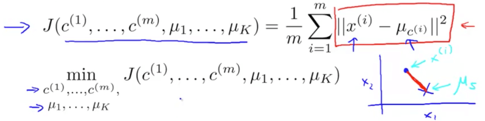

Steps in the algorithm:
- Cluster assignment step:
  - It minimizes J with respect to $c^{(i)},\cdots,c^{(m)}$
  - But let $\mu_{1},\cdots,\mu_{K}$ fixed
- Move centroid step:
  - It minimizes J with respect to $\mu_{1},\cdots,\mu_{K}$
  - But let $c^{(i)},\cdots,c^{(m)}$ fixed

#### Random Initialization

- We need to randomly initialize K cluster centroids, but how do we do it?
    - Method:
    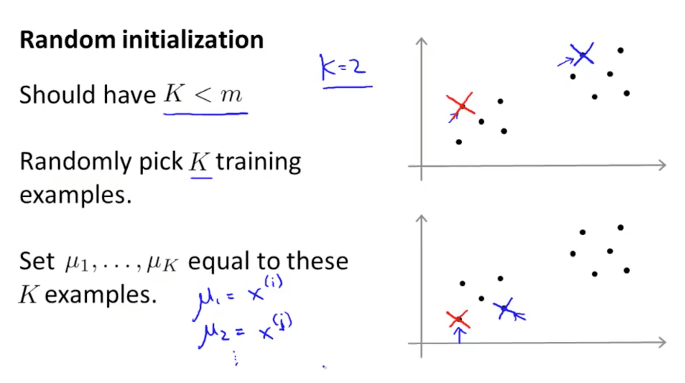
        1. Should have K < m : more clusters than examples is of course without meaning
        2. Randomly pick K training examples
                    - For example, picking k = 2
        3. Set $\mu_{1}$ to $\mu_{K}$ equal to these K examples

Random Initialization Technicality
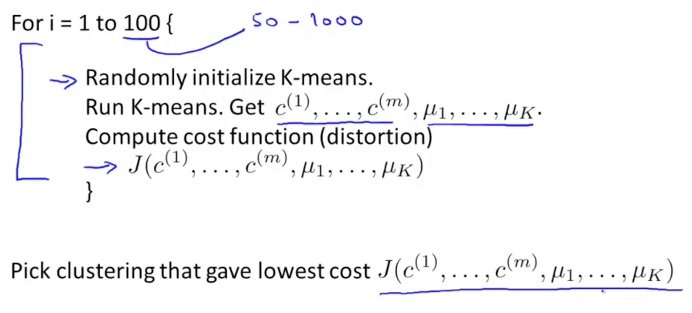

##### Bad local optima

**Note: K-means can end up at different solutions depending on different initialization**

Good local optima:
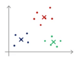

- If you are unlucky with random initialization, K-means:
    - Might get stuck in a bad local optima: 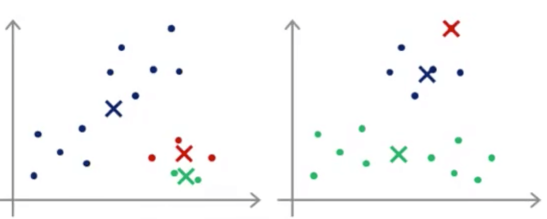
    - As you can see, the two graphs are not good
    - **The solution is to run K-means many times with different initialization**

#### Choosing the Number of Clusters

What is the right value of K?

- Elbow method
     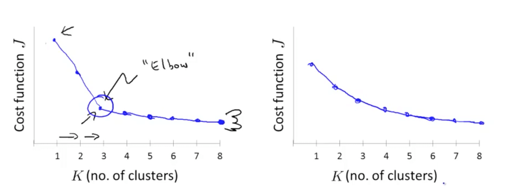
  - If in your plot you can see a elbow (quick decrease until a number, and then stagnation), choose the number selected by the elbow (left chart: number is 3).
  - The issue with this method is that it is not clear where the location of the elbow is (right chart). That's why the elbow method is not used that much.
  - Don't have too much expectation with that method.

- Another method:
  - Evaluate k-means to get clusters to use for some later purpose
    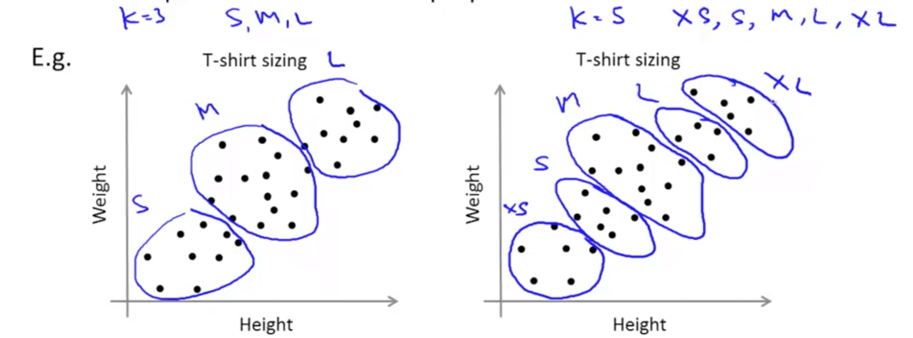
    - This would allow us to decide whether we want 3 or 5 clusters

