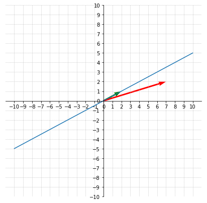
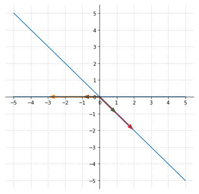
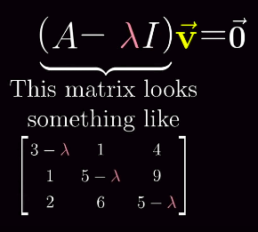

# Eigenvectors eigenvalues

## Linear tranformation

A linear transformation is a product of a matrix with a vector.

For example:

- Tranformation matrix: $A=\begin{bmatrix}
3 & 1\\
0 & 2\\
\end{bmatrix}$
- Vector $v = \begin{bmatrix}
2\\
1\\
\end{bmatrix}=GreenVector$

If we apply the transformation we have:

$$Av=\begin{bmatrix}
3 & 1\\
0 & 2\\
\end{bmatrix}\begin{bmatrix}
2\\
1\\
\end{bmatrix}=\begin{bmatrix}
3*2 + 1*1\\
0*2 + 2*1\\
\end{bmatrix}=\begin{bmatrix}
7\\
2\\
\end{bmatrix}=RedVector$$

- RedVector: GreenVector transformed

We can see that the RedVector  gets knocked off the span line (blue line) of the green vector.

## Eigenvectors

But some special vectors do remain on their own span (line). These special vectors are called **eigenvectors**.

Take a look at:
- Vector $v = \begin{bmatrix}
1\\
-1\\
\end{bmatrix}=GreenVector$

And
- Vector $w = \begin{bmatrix}
-1\\
0\\
\end{bmatrix}=BrownVector$

$$Av=\begin{bmatrix}
3 & 1\\
0 & 2\\
\end{bmatrix}\begin{bmatrix}
1\\
-1\\
\end{bmatrix}=\begin{bmatrix}
3*1 + 1*-1\\
0*1 + 2*-1\\
\end{bmatrix}=\begin{bmatrix}
2\\
-2\\
\end{bmatrix}=RedVector$$
And:

$$Aw=\begin{bmatrix}
3 & 1\\
0 & 2\\
\end{bmatrix}\begin{bmatrix}
-1\\
0\\
\end{bmatrix}=\begin{bmatrix}
3*-1 + 1*0\\
0*-1 + 2*0\\
\end{bmatrix}=\begin{bmatrix}
-3\\
0\\
\end{bmatrix}=OrangeVector$$

## Eigenvalues

We can see that the eigenvectors are on their line but are stretched by the transformation.

- GreenVector is tretched by 2
- BrownVector is tretched by 3

The factor of streching is the eigenvalue.

We now have the formula:

$$A\mathbf {\vec{v}} =\lambda \mathbf {\vec{v}}$$

- A: Transformation matrix
- v: Eigenvector
- $\lambda$: Eigenvalue (scalar)

## Identity matrix

As seen before we have:

$A\mathbf {\vec{v}} =\lambda \mathbf {\vec{v}}$

$\lambda$ is a scalar

Another way to write the equation is to use and identity matrix:

For example:

$$I=\begin{bmatrix}
1 & 0 & 0\\
0 & 1 & 0\\
0 & 0 & 1
\end{bmatrix}$$

We then have:

$$A\mathbf {\vec{v}} =(\lambda I) \mathbf {\vec{v}}$$

Note that you can transform it to:

$$(A -\lambda I)\mathbf {\vec{v}} = \vec{0}$$

