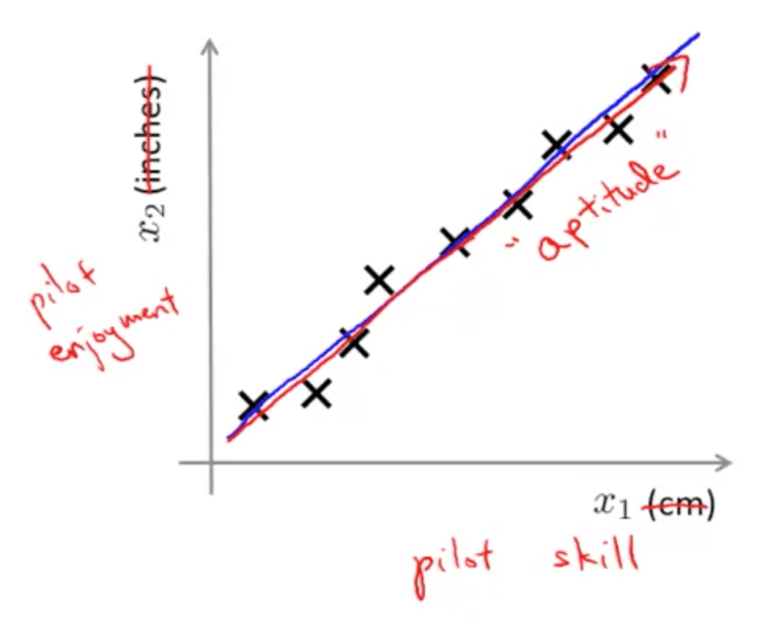
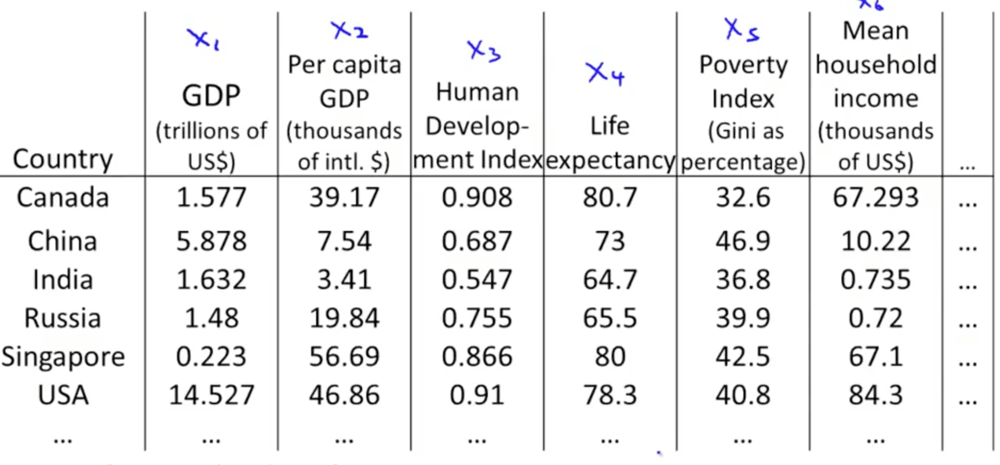
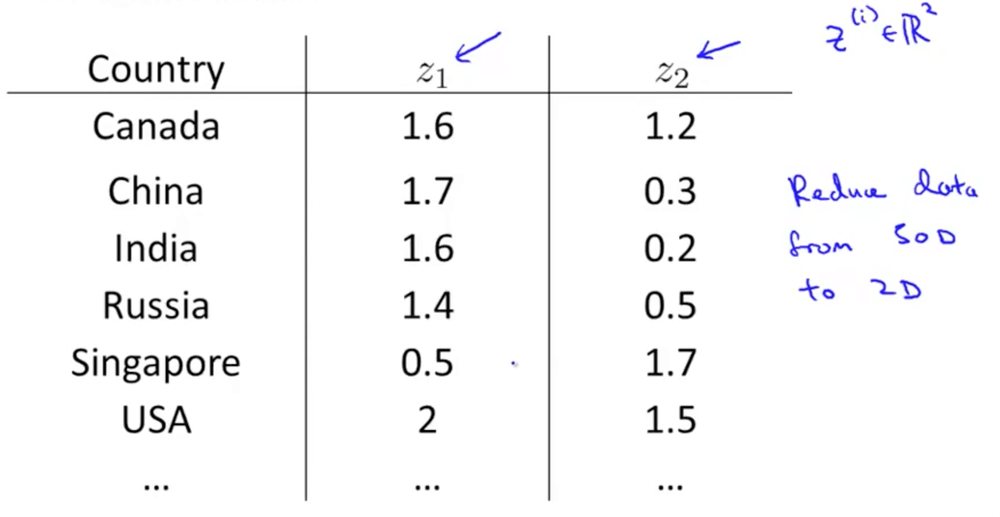
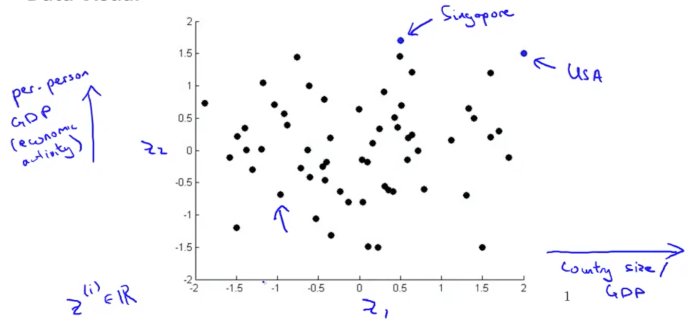

# Dimensionality reduction

When you use large datasets it is almost impossible to assess relationships within the data.

If you have a lot of rows (n samples) and a lot of columns (m features) it can not be ploted and visualized.

Then high dimensional datasets are hard to understand.

The challenge of Dimensionality Reduction is to help us:
- Visualize the data
- Analyze the data
- Understand the data

## Motivation

### Motivation I: Data Compression
- You are able to reduce the dimension of the data from 2D to 1D
    - For example, pilot skill and pilot happiness can be reduced to pilot's aptitude
    
    - Generally, you can reduce x1 and x2 to z1
    
- Your are able to reduce the dimension of the data from 3D to 2D
    - Project the data such that they lie on a plane
    - Specify two axes
        - z1
        - z2
    - You would then be able to reduce the data's dimension from 3D to 2D
    

### Motivation II: Visualization
- Given a set of data, how are able to examine the data such as this?

- We can use reduce the data's dimensionality from 50D to 2D 
    - Typically we do not know what the 2 dimensions' meanings are
    - But we can make sense of out of the 2 dimensions

