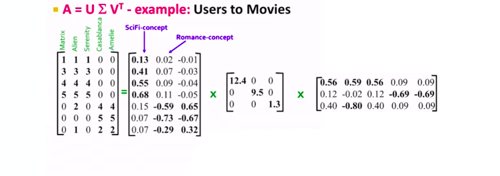

# SVD
### Dimensionality reduction is to discover the axis of data

Rather than representing evry points with 2 coordinates we represent each point with 1 coordinate (corresponding to the position of the point on the red line).

Note: By doing this we incur a bit of *error* as the point do not exactly lie on the line. 

Reducing dimensions allows you to :
- Discover hidden  correlations/topics
  - Words that occur commonly together
- Remove redundant and noisy features
  - Not all words are useful
- Interpretation and visualization
- Easier storage and processing of the data.

#### SVD Single Value Decomposition

Single Value Decomposition gives best axis to project on.

$A_{[m \times n]}=U_{[m \times r]} \Sigma{[r \times r]}(V_{[n \times r]})^T$

- A: input data matrix 
  - $m \times n$ matrix (example: m document, n terms)(every row is a document, every column is a word)
- U: Left singular vectors
  - $m \times r$ matrix (example: m document, r concepts)(every row is a document, every column is a topic)
- $\Sigma$: Singular values
  - $r \times r$ diagonal matrix (strength of each 'concept')(r ranking of the matrix A)(let think of r as a very small number)
- V: Right singular vectors
  - $n \times r$ matrix (n terms, r concepts)(every row is a term, every column is a topic)

$A \approx U \Sigma V^T = \sum_i\theta_iu_i . v_i^T$

Then it is always possible to decompose a real matrix A into 
$A_{[m \times n]}=U_{[m \times r]} \Sigma{[r \times r]}(V_{[n \times r]})^T$

Where:
- $U, \Sigma, V$: unique
- U, V: column orthonormal
  - $U^T U = I$; $V^T V=I$ (I: identity matrix) 
  - (Columns are orthogonal unit vectors)
- $\Sigma$: diagonal
  - Entries (singular values) are positive and sorted in decreasing order.

#### Example

We could like to discover concepts like: 
- A set of users who like science-fiction movies
- A set of users who like romance movies
- A set of users that don't really like science-fiction movies

We could then breakup the matrix A into:
1. Movies: A group of sci-fi or romance movies
2. Users: A group of sci-fi lovers or romance movies lovers

##### U: User to concept matrix

##### Σ: Concept strength

Note here that the third concept has very low strength (1.3). So the third concept will not be important.

##### $V^T$: Movie to concept similarity matrix

