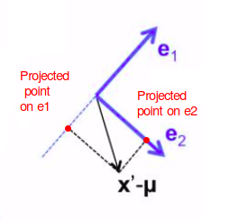
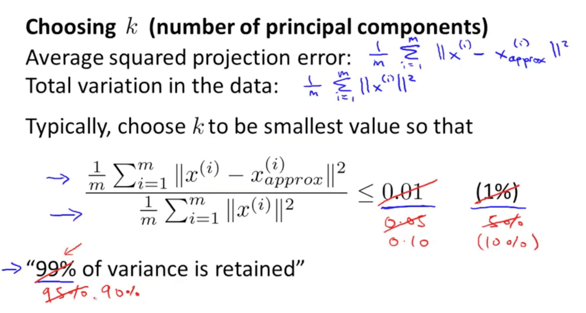

# Principal Component Analysis (PCA)

## PCA Goal


Goal of PCA:

- It's trying to find a lower dimensional surface onto which to project the data, so as to minimize this squared projection error
- To minimize the square distance between each point and the location of where it gets projected. 
    

### Dimensionality reduction


## Before using PCA: Mean normalization + feature scaling

NOTE: Before performing PCA, perform mean normalization (mean = 0) and feature scaling.

Data pre-processing step:

- You must always do this before doing PCA
  
  - Commonly: $S_j = \sigma_j$ = standard deviation of j
  - Less common: $S_j=Max-Min$

### How mean normalization (mean recentering) works 

```
        Mouse1	Mouse2	Mouse3	Mouse4	Mouse5	Mouse6
Gene1	10      11	    8	    3	    2.0	    1
Gene2	6       4	    5	    3	    2.8	    1
```


We calculate the mean of each row.

```python
gene1mean = df.loc['Gene1'].mean()
gene2mean = df.loc['Gene2'].mean()
```

We recenter all rows value by substracting the mean.

```python
dfcentered=df.copy()
dfcentered.loc['Gene1'] = df.loc['Gene1']-gene1mean
dfcentered.loc['Gene2'] = df.loc['Gene2']-gene2mean
```

Recentered data becomes:


### Realize  Mean normalization + feature scaling with scikit-lean

```python
# StandardScaler = Standardize features by removing the mean and scaling to unit variance
from sklearn.preprocessing import StandardScaler

scaler = StandardScaler()
# Compute the mean and std to be used for later scaling.
scaler.fit(df)
# Perform standardization by centering and scaling
scaled_data = scaler.transform(df)
```

## PCA Problem Formation

### Find the slope of the line that best fit the projections of all centered data

Note: The vector c is the projection of a on the red line.


We want to find the slope of the red line that minimize b for all data points (minimization of the orthogonal distance).


Be careful: PCA is not linear regression
- PCA is a minimization of the orthogonal distance


## Principal Component Analysis Algorithm

- PCA intuition
  - You need to compute the vector or vectors
    
    - Left graph: compute vector $z_1$
    - Right graph: compute vector $z_1$ and $z_2$

## PCA Algorithm ( How is it done )

Reduce data from n-dimensions to k-dimensions

### 0. Realize Mean normalization + feature scaling with scikit-lean

See above "Realize  Mean normalization + feature scaling with scikit-lean" in previous chapters.

### 1. Compute the "covariance matrix" $\Sigma$ (sigma)

Covariance is a measure of how much two random variables **(in general) tend** to vary together. It’s similar to variance, but where variance tells you how a single variable varies, covariance tells you how two variables **tend** (in general) to vary together.


The covariance between two variables is positive when, **in general** they **tend** to move in the same direction and negative if they tend to move in opposite directions.

Be careful, you can have points that behave in an opposite way to what the covariance tells. Indeed covariance is an overall trend of all points.

- Population Covariance:
$cov(x, y) = \frac{1}{{N}} \sum\limits_{i}^{N}{(x_i - \mu_x)(y_i - \mu_y)}$   
With $\mu_x$ is the population mean for x, and $\mu_y$ is the population mean for y

- Sample Covariance:
$\Sigma = cov(x, y) = \frac{1}{{n-1}} \sum\limits_{i}^{n}{(x_i - \bar x)(y_i - \bar y)}$
With $\bar x$ and $\bar y$ are the mean as well but this notation designates it as a sample mean rather than a population mean.

We can apply this formula to calculate the covariance matrix:

```
  |        x        |        y        |        z        | 
  -------------------------------------------------------
x | cov(x,x)=var(x) | cov(x,y)        | cov(x,z)        |
y | cov(y,x)        | cov(y,y)=var(y) | cov(y,z)        |
z | cov(z,x)        | cov(z,y)        | cov(z,z)=var(z) |
```

**!!!!!!!!!!!!!! Be careful with the matrix diagonal !!!!!!!!!!!!!!**


For example:


Gives the covariance matrix


On centered data, covariance matrix is the same thing as:
$$cov(centered\_matrix) = \frac{1}{n-1}centered\_matrix\ .\ centered\_matrix^T $$

In python:

```
import pandas as pd
matrix = pd.DataFrame([[1,1,1],
              [1,2,1],
              [1,3,2],
              [1,4,3]
          ], columns=['x','y','z'])

matrix.cov()
```

On centered data this is equivalent:
```
print("On centered data:")
np.cov(matrix.T)

print("Is equivalent to...")

number_of_elements = matrix.shape[0]
np.dot(matrix.T, matrix)/(number_of_elements-1)
```


### 2. Insert Covariance matrix in the Eigenvalues and eigenvectors formula

Let's use the following covariance matrix:

$covarianceMatrix\begin{bmatrix}
2.0 & 0.8 \\
0.8 & 0.6 \\
\end{bmatrix}$


If you take a random vector and you multiply it by the covariance matrix, it turns the vector towards the **dimension** of the greatest variance of the data.

Here the vector v has been multiplied multiple times by the covariance matrix (red vectors):


Something we can note here:**The more you multiply the vector with the covariance matrix, the less the resulting vector seems to turn.**

Indeed, the last vectors rotate much less than the first time we applied the covariance matrix multiplication to the original vector.

In fact it tends to find the eigenvector.

We want to find the vectors **v** which aren't turned:

$$\Sigma \vec v = \lambda \vec v$$ 
With:
- $\vec v$ eigenvectors of $\Sigma$, 
- $\lambda$ corresponding eigenvalues (scalar)
- principal components = eigenvectors w. largest eigenvalues 

----

$I$ is an identity matrix:

$$I=\begin{bmatrix}
1 & 0 & 0\\
0 & 1 & 0\\
0 & 0 & 1
\end{bmatrix}$$

We can transform the previous equation with:

$$\Sigma \vec{v} =(\lambda I) \vec{v}$$

Then:

$$\Sigma \vec{v} - (\lambda I) \vec{v} =0$$

To end:

$$\Sigma - \lambda I =0$$


### 3. Finding Principal components

#### 3.1. Finding eigenvalues by solving determinant

The objective is to find eigenvalues by solving : $det(\Sigma - \lambda I)=0$

$det \begin{bmatrix}
2.0-\lambda & 0.8 \\
0.8 & 0.6-\lambda
\end{bmatrix}=0$

Then:
$(2-\lambda)(0.6-\lambda)-0.8*0.8=0\\
\lambda^2-2.6\lambda+0.56=0$

This last equation can be solved like in any other quadratic equation.
Two solution are possible:

$\{ \lambda_1,\lambda_2 \}=\frac{1}{2}(2.6\pm \sqrt{2.6^2-4*0.56}=\{2.3630145,0.2369854\}$

- **solution1=2.3630145**
- **solution2=0.2369854**


#### 3.2. Finding $i^{th}$ eigenvector

We can now use the definition of the eigenvectorby solving $\Sigma \vec v_i = \lambda_i \vec v_i$

For each eigenvector multiplicated by the covariance matrix is going to get longer or shorter by the corresponding eigen value. 

##### 3.2.1. For solution1

$\begin{bmatrix}
2.0 & 0.8 \\
0.8 & 0.6
\end{bmatrix}\begin{bmatrix}
e_{1,1} \\
e_{1,2}
\end{bmatrix} = 2.36 \begin{bmatrix}
e_{1,1} \\
e_{1,2}
\end{bmatrix}$

We can transform this into two equations:

- $2.0e_{1,1}+0.8e_{1,2}=2.3630145e_{1,1}$
- $0.8e_{1,1}+0.6e_{1,2}=2.3630145e_{1,2}$

We obtain from these two equations:
$e_{1,1}=2.2e_{1,2}$

There are lots and lots of vectors that satisfy this condition so I'm going to take the simplest one that satisfies the condition.

$e_{1} \sim \begin{bmatrix}
2.2 \\
1 \\
\end{bmatrix}$

$\sim$ means "similar to".

**REMEMBER: EIGENVECTORS HAVE TO BE UNIT LENGTH (Its euclidan_distance=1 or $\lVert e_{1} \rVert = 1$).**

This is to avoid multiple solutions because there are lots of solutions otherwise.

So:

$euclidian\_distance^2=2.2^2 +1^2$
$euclidian\_distance=\sqrt{2.2^2 +1^2}$
$euclidian\_distance=\sqrt{5.84}$
$euclidian\_distance=2,416609$

If we want $euclidian\_distance=1$ then we have to divide x and y by 2,416609.

$e_{1} = \frac{1}{2,416609} \begin{bmatrix}
2.2 \\
1 \\
\end{bmatrix}=\begin{bmatrix}
0,910366 \\
0,413802 \\
\end{bmatrix}$

----

To summarize solution1...

We had:
$$\Sigma \vec v_i = \lambda_i \vec v_i$$
$$\Sigma \begin{bmatrix}
e_{1,1} \\
e_{1,2}
\end{bmatrix} = \lambda_i \begin{bmatrix}
e_{1,1} \\
e_{1,2}
\end{bmatrix}$$

And we found:

$\Sigma=\begin{bmatrix}
2.0 & 0.8 \\
0.8 & 0.6 \\
\end{bmatrix}$

$\vec v_1=e_1=\begin{bmatrix}
0,910366 \\
0,413802 \\
\end{bmatrix}$

$\lambda_1=2.3630145$


##### 3.2.2. For solution2

$\begin{bmatrix}
2.0 & 0.8 \\
0.8 & 0.6
\end{bmatrix}\begin{bmatrix}
e_{2,1} \\
e_{2,2}
\end{bmatrix} = 0.2369854 \begin{bmatrix}
e_{2,1} \\
e_{2,2}
\end{bmatrix}$

We can transform this into two equations:

- $2.0e_{2,1}+0.8e_{2,2}=0.2369854 e_{2,1}$
- $0.8e_{2,1}+0.6e_{2,2}=0.2369854 e_{2,2}$

We obtain from these two equations:
$e_{2,2}=-2.2e_{2,1}$

$e_{2} \sim \begin{bmatrix}
-1 \\
2.2 \\
\end{bmatrix}$

$\sim$ means "similar to".

**REMEMBER: EIGENVECTORS HAVE TO BE UNIT LENGTH (Its euclidan_distance=1 or $\lVert e_{1} \rVert = 1$).**

This is to avoid multiple solutions because there are lots of solutions otherwise.

So:

$euclidian\_distance^2=(-2.2)^2 +1^2$
$euclidian\_distance=\sqrt{2.2^2 +1^2}$
$euclidian\_distance=\sqrt{5.84}$
$euclidian\_distance=2,416609$

If we want $euclidian\_distance=1$ then we have to divide x and y by 2,416609.

$e_{1} = \frac{1}{2,416609} \begin{bmatrix}
-1 \\
2.2 \\
\end{bmatrix}=\begin{bmatrix}
-0,413802 \\
0,910366 \\
\end{bmatrix}$

----

To summarize solution2...

We had:
$$\Sigma \vec v_i = \lambda_i \vec v_i$$
$$\Sigma \begin{bmatrix}
e_{2,1} \\
e_{2,2}
\end{bmatrix} = \lambda_i \begin{bmatrix}
e_{2,1} \\
e_{2,2}
\end{bmatrix}$$

And we found:

$\Sigma=\begin{bmatrix}
2.0 & 0.8 \\
0.8 & 0.6
\end{bmatrix}$

$\vec v_2=e_2=\begin{bmatrix}
−0,413802 \\
0,910366 \\
\end{bmatrix}$

$\lambda_2=0.2369854$

#### Find eigenvalues and eigen vectors in python

```python
n_components=2

# Standardizing the features
from sklearn.preprocessing import StandardScaler
X_std = StandardScaler().fit_transform(x)

from sklearn.decomposition import PCA
pca = PCA(n_components=n_components)
pca.fit(X_std)

# Singular values with np.linalg.eig()
print("\n---------------------------------------")
print("sklearn.decomposition.PCA()")
print("---------------------------------------")
print("singular values with n_components components\n", pca.singular_values_)
print("eigenvectors with n_components components:\n", pca.components_)

# Singular values with np.linalg.eig()
print("\n---------------------------------------")
print("np.linalg.eig()")
print("---------------------------------------")
evals_squared, evecs = np.linalg.eig(np.dot(X_std.T,X_std))
evals = np.sqrt(evals_squared)
print("singular values with n components\n", evals[0:n_components])
print("eigenvectors with n components:\n", evecs.T[0:n_components])

# np.linalg.eig()
print("\n---------------------------------------")
print("Singular values with np.linalg.svd()")
print("---------------------------------------")
u, s, v = np.linalg.svd(X_std)
print("singular values with n components\n", s[0:n_components])
print("eigenvectors with n components:\n", v[0:n_components])
```


### 4. Project to new dimensions

We found:

- Eigenvector $e_1$ with eigenvalue $\lambda_1$
- Eigenvector $e_2$ with eigenvalue $\lambda_2$

Imagine we have more dimensions and we found multiple eigenvectors.
- From all these eigenvectors we take m of them (**THOSE WITH THE BIGGEST EIGENVALUES**).

Indeed: EIGENVECTORS WITH THE BIGGEST EIGENVALUES ARE THE ONES THAT CAPTURE THE MOST VALUES ONCE PROJECTED ON THEM.

We then have:

- Eigenvectors: $e_1 \dots e_m$
- All original points coordinates: $x={x_1 \dots x_d}$
  - d is our original dimensionality 

We want all new coordinates: $x'={x'_1 \dots x'_m}$





To obtain these new coordinates, we:
  1. "Center" the instance (substract the mean): $x'-\mu$
  2. "Project" to each dimension: $(x'-\mu)^T e_j for\ j=1\ to\ \dots \ m$


To summarize both operations:

$(\vec{x}-\vec{u})=\begin{bmatrix}
x_1-\mu_1 \\
x_2-\mu_2 \\
\vdots\\
x_d-\mu_d
\end{bmatrix}$

$\begin{bmatrix}
x_1' \\
x_2' \\
\vdots \\
x_m'
\end{bmatrix}
=\begin{bmatrix}
(\vec{x}-\vec{u})^T\vec{e_1} \\
(\vec{x}-\vec{u})^T\vec{e_2} \\
\vdots\\
(\vec{x}-\vec{u})^T\vec{e_m} \\
\end{bmatrix}=\begin{bmatrix}
(x_1-\mu_1)e_{1,1}+(x_2-\mu_2)e_{1,2}+\dots+(x_d-\mu_d)e_{1,d}\\
(x_1-\mu_1)e_{2,1}+(x_2-\mu_2)e_{2,2}+\dots+(x_d-\mu_d)e_{2,d}\\
\vdots\\
(x_1-\mu_1)e_{m,1}+(x_2-\mu_2)e_{m,2}+\dots+(x_d-\mu_d)e_{m,d}\\
\end{bmatrix}$


## Andrew NG

How to computed $\Sigma$ in python:

PCA: Is truncatedSVD on centered data (by per-feature mean substraction).

TruncatedSVD: Can be directly used on non-centered data.

In practice TruncatedSVD is useful on large sparse datasets which cannot be centered without making the memory usage explode.


----


- You can use eig (eigen) or svd (singular value decomposition) but the svd is more stable.
  - You can use any library in other languages that does singular value decomposition
  - You will get 3 matrices: U, S and V
  - But we only need matrix U where we manipulate to get z that is a k x 1 vector


## Applying PCA

### Reconstruction from Compressed Representation
- We can go from lower dimensionality to higher dimensionality


### Choosing the Number of Principal Components
- k is the number of principal components 
    - But how do we choose k?
    
- There is a more efficient method on the right compared to the left
    - We then use the S matrix for calculations 
    
    
- You would realise that PCA can retain a high percentage of the variance even after compressing the number of dimensions of the data

### Advice for Applying PCA
- Supervised learning
    - For many data sets, we can reduce by 5-10x easily to ensure our learning algorithm runs much faster
    
- Application of PCA
    1. Compression
        - Reduce memory or disk needed to store data
        - Speed up learning algorithm   
            - We choose k by percentage of variance retained
    2. Visualization
        - We choose only k = 2 or k = 3 
- Bad uses of PCA
    1. To prevent over-fitting
        - Regularization is better because it is less likely to throw away valuable information as it knows the labels
        
    2. Running PCA without consideration
        

